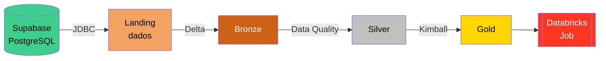
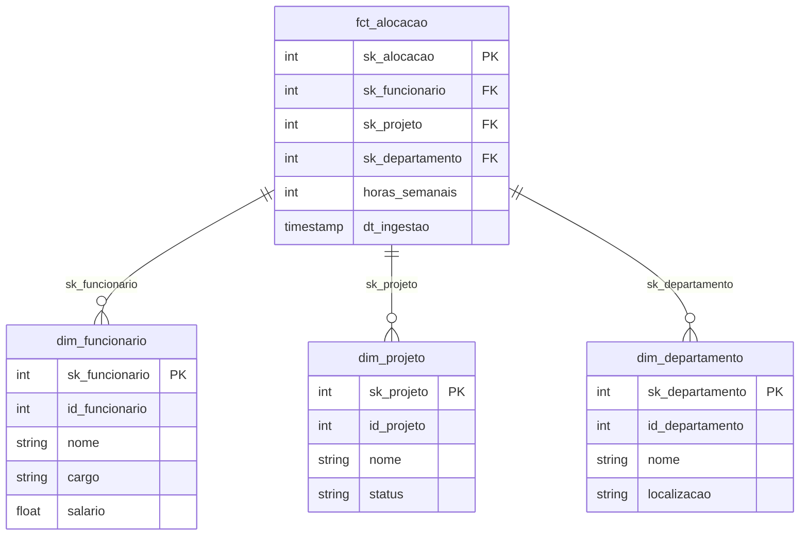

# Arquitetura do Pipeline

## Visão Geral

O pipeline segue o padrão **Arquitetura Medalhão**, onde os dados evoluem progressivamente em qualidade e estrutura ao passar por cada camada.



---

## Camadas

### 🛬 Landing (`landing.dados`)

- **Origem:** Supabase (PostgreSQL)
- **Formato:** Delta Lake
- **Transformações:** Nenhuma — dados brutos
- **Tabelas:** `departamentos`, `funcionarios`, `projetos`, `alocacoes`

A camada Landing é a zona de entrada dos dados. A extração é feita via **JDBC** diretamente do PostgreSQL do Supabase, e os dados são gravados como tabelas csv no schema `landing.dados`.

---

### 🥉 Bronze (`bronze`)

- **Origem:** `landing.dados`
- **Formato:** Delta Lake
- **Transformações:** Leitura e regravação como Delta
- **Tabelas:** `departamentos`, `funcionarios`, `projetos`, `alocacoes`

A camada Bronze consolida os dados em Delta Lake com versionamento completo, possibilitando **Time Travel** e auditoria de alterações.

---

### 🥈 Silver (`silver`)

- **Origem:** `bronze`
- **Formato:** Delta Lake
- **Transformações (Data Quality):**
    - Remoção de registros com campos obrigatórios nulos
    - Validação de valores numéricos (salário > 0, horas > 0)
    - Padronização de texto (trim, lowercase onde aplicável)
    - Adição de coluna `dt_ingestao` com timestamp de processamento
    - Adição de coluna `origem` identificando a fonte

---

### 🥇 Gold (`gold`)

- **Origem:** `silver`
- **Formato:** Delta Lake
- **Modelo:** Dimensional (Ralph Kimball)

#### Modelo Estrela



---

## Orquestração — Databricks Job

Os 4 notebooks são encadeados em um **Job** no Databricks:

```
Job: pipeline_medalhao
│
├── Task 1: 01_landing    → extrai do Supabase
├── Task 2: 02_bronze     → depende de Task 1
├── Task 3: 03_silver     → depende de Task 2
└── Task 4: 04_gold       → depende de Task 3
```

Cada task só inicia após a anterior ser concluída com sucesso, garantindo a integridade do pipeline.

## 📝 Referências

- 💻 [jlsilva01/spark-delta-minio-sqlserver](https://github.com/jlsilva01/spark-delta-minio-sqlserver)
- 📘 [Documentação Delta Lake](https://docs.delta.io/)
- 📘 [Documentação Databricks](https://docs.databricks.com/)
- 📘 [Documentação Supabase](https://supabase.com/docs)
- 📘 [Documentação PySpark](https://spark.apache.org/docs/latest/api/python/)
